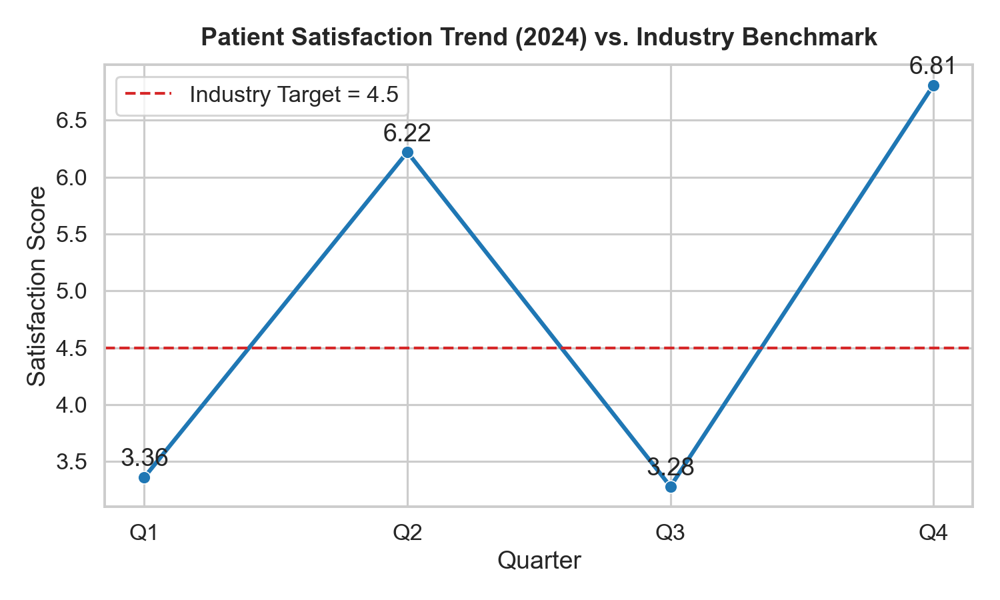

# Healthcare Performance Analysis (2024)

**Analyst:** Krish Rohilla  
**Email:** 24f2003053@ds.study.iitm.ac.in  

## 📊 Key Findings
- Patient satisfaction scores show high fluctuation:  
  - Q1 = 3.36  
  - Q2 = 6.22  
  - Q3 = 3.28  
  - Q4 = 6.81  
- The **average score = 4.92**, which is above the industry target (4.5).  
- However, inconsistent performance (low Q1 & Q3) reveals operational inefficiencies.

## 📌 Business Implications
- Service quality varies across the year, possibly due to staffing, scheduling, or seasonal patient load.  
- Inconsistent patient experience could lead to **brand risk and churn**.

## ✅ Recommendations
1. **Improve Service Quality:** Regular training programs, standardization of care protocols.  
2. **Reduce Wait Times:** Optimize scheduling with predictive analytics, add staff during peak hours.  
3. **Consistency:** Focus on stabilizing quarterly performance rather than peaks and drops.

## 📈 Visualization
The chart below shows quarterly performance compared to the industry target:

